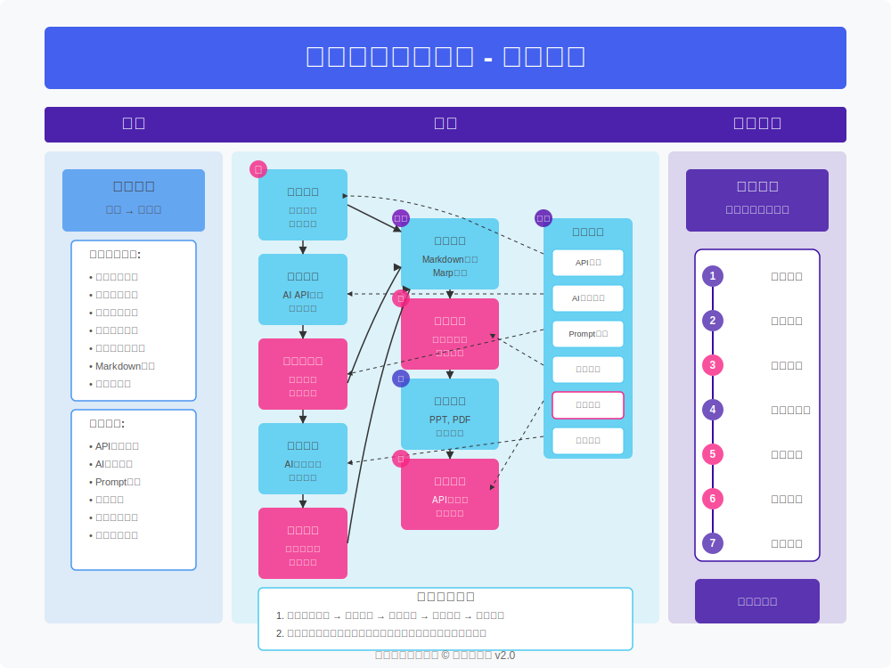

# 歌曲投影片生成器

將您喜愛的歌曲轉換成精美投影片！這款桌面應用程式可以幫助您：

- 輸入歌曲名稱，自動搜尋歌詞
- 通過AI生成與歌詞相符的精美背景圖
- AI編輯歌詞內容和排版，符合Marp語法
- 投影片預覽、手動微調投影片格式
- 一鍵匯出為多種格式（PPT、PDF等）

## 主要功能

✅ **歌詞搜尋與編輯**：輸入歌名即可搜尋歌詞，並可以手動編輯和調整
✅ **AI圖片生成**：自動為每張投影片創建相配的背景圖，支持本地模型和雲端API
✅ **圖片預覽與替換**：不滿意生成的圖片？一鍵重新生成或替換為您自己的圖片
✅ **高效資源管理**：追蹤API使用量和成本，優化資源利用

## 快速上手

1. 下載並安裝應用程式
2. 啟動後輸入您想要處理的歌曲名稱
3. 選擇歌詞版本
4. 選擇投影片模板
5. 生成背景圖片
6. 匯出為您需要的格式

無需複雜設置，下載即可使用！

## 系統需求

- Windows 10 或更高版本
- macOS 10.14 或更高版本
- 至少 4GB 記憶體
- 約 200MB 磁碟空間

## 授權協議

本軟體採用 MIT 授權協議。

## 系統架構

 