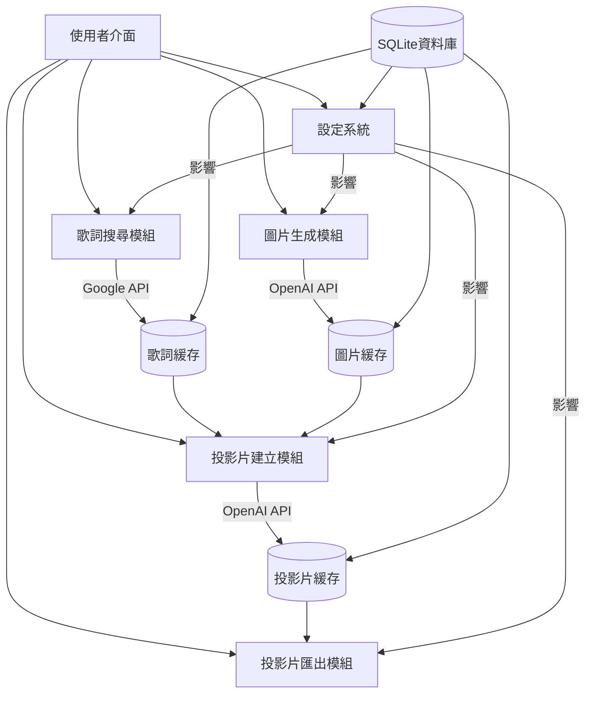

# 歌曲投影片生成器 - 專案規格書

## 1. 專案概述

### 1.1 專案目標
開發一個基於Electron的桌面應用程式，能夠將歌曲名稱轉換為精美投影片，支援Windows和macOS系統，提供繁體中文、簡體中文和英文界面。

### 1.2 核心功能
- 歌詞自動搜尋
- AI生成符合歌詞風格的背景圖片
- AI編輯歌詞並排版為Marp格式
- 投影片預覽和微調
- 多格式匯出功能

## 2. 技術架構

### 2.1 開發環境
- Node.js 18+
- Electron 28+
- SQLite 3
- Marp CLI
- React 18 (前端框架)
- Electron Builder (打包工具)

### 2.2 專案結構
```
lyrics-to-slides/
├── src/
│   ├── main/                 # Electron主程序
│   ├── renderer/             # 前端渲染程序
│   ├── preload/              # 預加載腳本
│   └── common/               # 共用模組
├── resources/                # 靜態資源
├── database/                 # SQLite資料庫
├── cache/                    # 緩存目錄
│   ├── images/               # 圖片緩存
│   └── lyrics/               # 歌詞緩存
├── dist/                     # 構建輸出目錄
└── ...
```
### 2.3 功能架構圖


## 3. 模組詳細規格

### 3.1 歌詞搜尋模組

#### 功能描述
- 通過Google Custom Search JSON API搜尋歌詞
- 支援關鍵字優化搜尋
- 實現歌詞解析和清洗

#### 實現方式：
- 使用 `node-fetch` 套件連接 Google API
- 使用 `cheerio` 套件解析網頁內容，提取乾淨的歌詞
- 建立歌詞緩存系統，避免重複搜尋

#### API設計
```javascript
class LyricsSearchService {
  constructor(googleApiKey, searchEngineId);
  async searchLyrics(songTitle, artist = "");
  async fetchLyricsFromUrl(url);
  async parseAndCleanLyrics(html);
}
```

#### 資料儲存
- 將搜尋結果緩存在SQLite數據庫中
- 緩存表結構：
```json
{
  "songId": "唯一識別碼",
  "title": "歌曲名稱",
  "artist": "歌手/樂團名稱",
  "lyrics": "完整歌詞內容",
  "source": "歌詞來源網址",
  "timestamp": "搜尋時間戳記"
}
```

### 3.2 圖片生成模組

#### 功能描述
- 使用OpenAI DALL-E API生成背景圖片
- 支援圖片風格自訂
- 圖片緩存管理

#### 實現方式：
- 使用 `openai` 套件連接 DALL-E API
- 利用歌曲名稱和歌詞摘要構建 AI prompt
- 實現圖片緩存系統，以歌曲 ID 命名存儲

#### API設計
```javascript
class ImageGenerationService {
  constructor(openaiApiKey);
  async generateImage(songTitle, lyrics, promptTemplate);
  async saveImageToCache(songTitle, imageUrl);
  async getImageFromCache(songTitle);
}
```

#### 提示詞管理
- 預設提示詞：`為以下歌詞創建背景圖片：「{{lyrics}}」，風格：簡約現代，適合教會或歌唱聚會使用的投影片背景，不要包含任何文字或人物，只需要創作和諧簡、約的抽象背景。`
- 支援變數替換：`{{lyrics}}`, `{{songTitle}}`等

#### 資料儲存
- 將生成結果緩存在SQLite數據庫中
- 圖片存儲本地位置：/app_data/images/{songId}.png
- 緩存表結構：
```json
{
  "songId": "唯一識別碼",
  "imagePath": "本地圖片路徑",
  "prompt": "生成圖片使用的提示詞",
  "timestamp": "生成時間戳記"
}
```

### 3.3 投影片建立模組

#### 功能描述
- 使用OpenAI GPT-4o-mini生成Marp格式的投影片內容
- 支援多種排版風格
- 支援手動編輯和微調

#### 實現方式：
- 使用 `openai` 套件連接 GPT-4o-mini API
- 將歌詞和背景圖片路徑構建 AI prompt
- 使用 Marp 框架轉換 Markdown 文本為投影片

#### API設計
```javascript
class SlideGenerationService {
  constructor(openaiApiKey);
  async generateSlides(lyrics, imageUrl, promptTemplate);
  async previewSlides(marpContent);
  async saveSlideTemplate(title, marpContent);
}
```

#### 提示詞管理
建議的預設投影片生成提示詞：
```
你是一個專業的文件轉換助手，專精於將歌詞轉換成符合Marp投影片格式的Markdown文件。請遵循以下要求：

1. 將每個段落或每2-3行歌詞放在一張投影片上
2. 使用"---"作為投影片分隔符
3. 在每張投影片頂部加入背景圖片：
4. 文字應置中顯示，使用大字體
5. 文字顏色應確保在背景上清晰可見
6. 不要添加任何不在原歌詞中的內容
7. 第一張投影片顯示歌曲標題和歌手名稱(如有提供)

歌詞內容：
{{lyrics}}
```
投影片格式範例：
```
---
marp: true
theme: default
paginate: false
backgroundColor: "black"
color: "white"
style: |
  section {
    display: flex;
    justify-content: center;
    align-items: center;
    text-align: center;
  }
  h1, h2, h3, p {
    text-shadow: 2px 2px 4px rgba(0, 0, 0, 0.7);
  }
---


# 第一首歌曲名稱

## 歌手/樂團名稱

---


第一行歌詞
第二行歌詞

---
```

#### 編輯功能：
- 提供 Markdown 編輯器供使用者微調投影片內容
- 支援即時預覽功能，使用 Marp 渲染預覽
- 提供常用格式調整按鈕：字體大小、對齊方式等

### 3.4 投影片匯出模組

#### 功能描述
- 基於Marp CLI實現多格式匯出
- 支援PDF、PPTX、HTML等格式
- 自訂輸出路徑和檔名

#### 實現方式：
- 集成 Marp CLI 作為 Electron 應用程式的一部分
- 使用 Node.js 的子進程執行 Marp 命令

#### API設計
```javascript
class SlideExportService {
  constructor();
  async exportToPDF(marpContent, outputPath);
  async exportToPPTX(marpContent, outputPath);
  async exportToHTML(marpContent, outputPath);
  async batchExport(marpContent, formats, outputPath);
}
```

#### 支援格式：
- PDF (高品質列印用)
- PPTX (Microsoft PowerPoint)
- HTML (網頁演示)
- PNG 圖片序列

#### 操作流程：
1. 使用者選擇匯出格式
2. 選擇匯出目標路徑
3. 設定匯出參數（解析度、品質等）
4. 顯示匯出進度條
5. 完成後提供打開檔案或開啟資料夾選項

### 3.5 設定系統模組

#### 功能描述
- 提供完整的應用程式設定界面，管理各項功能參數。
    - 基本設定（主題、語言、匯出路徑）
    - API金鑰管理
    - 提示詞模板管理
    - 緩存管理

#### 實現方式：
- 使用 Electron 的 `electron-store` 套件保存設定
- 設計直觀的表單界面，分類管理不同設定

#### 設定項目：
- 基本設定
    - 預設匯出路徑
    - 主題顏色選項
    - 語言選項
- API 金鑰設定
    - OpenAI API 金鑰
    - Google API 金鑰
    - Google 自訂搜尋引擎 ID
- 提示詞(prompt)模板管理
    - 圖片生成 prompt
    - 投影片文本生成 prompt
- 資料管理
    - 緩存清理選項
- 設定保存
    - 一鍵保存所有設定
    - 一鍵還原所有設定至預設值

#### 資料結構範例
```javascript
{
  "general": {
    "defaultExportPath": "path/to/export",
    "theme": "light", // light, dark, system
    "language": "zh-TW" // zh-TW, zh-CN, en
  },
  "api": {
    "openai": {
      "apiKey": "sk-..."
    },
    "google": {
      "apiKey": "...",
      "searchEngineId": "..."
    }
  },
  "functions": {
    "lyricsSearch": "google",
    "imageGeneration": "dalle",
    "slideGeneration": "gpt-4o-mini"
  },
  "templates": {
    "imagePrompt": "為以下歌詞創建背景圖片：「{{lyrics}}」，風格：簡約現代...",
    "slidePrompt": "你是一個專業的文件轉換助手..."
  }
  ...(省略)
}
```

#### 安全考量：
- API 金鑰進行加密存儲
- 避免將金鑰直接硬編碼在應用程式中
- 提供金鑰驗證功能

### 3.6 資料庫模組

#### 功能描述：
- 使用 SQLite 資料庫進行資料持久化存儲，並實現檔案緩存系統。

#### 實現方式：
- 使用 `better-sqlite3` 套件實現 SQLite 資料庫操作
- 設計資料表結構，管理各類資料

#### 資料表設計
1. 歌曲資料表 (songs)
```sql
CREATE TABLE songs (
  id INTEGER PRIMARY KEY AUTOINCREMENT,
  title TEXT NOT NULL,
  artist TEXT,
  lyrics TEXT NOT NULL,
  source_url TEXT,
  created_at TIMESTAMP DEFAULT CURRENT_TIMESTAMP
);
```

2. 圖片緩存資料表 (images)
```sql
CREATE TABLE images (
  id INTEGER PRIMARY KEY AUTOINCREMENT,
  song_id INTEGER,
  image_path TEXT NOT NULL,
  prompt TEXT,
  created_at TIMESTAMP DEFAULT CURRENT_TIMESTAMP,
  FOREIGN KEY (song_id) REFERENCES songs(id)
);
```

3. 投影片模板資料表 (templates)
```sql
CREATE TABLE templates (
  id INTEGER PRIMARY KEY AUTOINCREMENT,
  name TEXT NOT NULL,
  content TEXT NOT NULL,
  format TEXT DEFAULT 'marp',
  created_at TIMESTAMP DEFAULT CURRENT_TIMESTAMP
);
```

4. 設定資料表 (setting)
```sql
CREATE TABLE Settings (
  key TEXT PRIMARY KEY,
  value TEXT NOT NULL,
  updated_at TIMESTAMP DEFAULT CURRENT_TIMESTAMP
);
```

## 4. 使用者界面設計

### 4.1 設計原則
- 簡潔現代設計，遵循現代桌面應用程式設計風格
- 步驟式流程設計，降低使用難度
- 支援淺色/深色主題
- 響應式設計，適應不同螢幕尺寸
- 採用 4 步驟工作流程：
    1. 歌曲搜尋：輸入歌曲名稱和歌手/樂團(選填)，搜尋歌詞
    2. 圖片生成：根據歌詞生成背景圖片
    3. 投影片編輯：編輯投影片內容和格式
    4. 匯出投影片：選擇格式並匯出投影片

### 4.2 主介面：
- 頂部標題欄：應用程式標題、視窗控制按鈕
- 搜尋輸入區域（歌曲名稱、歌手/樂團）
- 投影片預覽區域
- 側邊欄：主要功能導航（生成、匯出、設定...）
- 主內容區：顯示當前操作步驟
- 底部狀態欄：顯示處理狀態、版本信息

### 4.3 設定界面
- 分類標籤式設計（基本設定、API金鑰、提示詞模板、緩存管理）
- 保存/重置按鈕
- 測試連接功能

### 4.4 編輯界面
- 分割視圖（Markdown編輯器+預覽）
- 實時預覽功能
- 格式工具欄

## 5. 開發實施計劃

### 5.1 階段一：基礎架構搭建
- 設置Electron專案
- 實現基本UI框架
- 設置SQLite數據庫連接

### 5.2 階段二：核心功能實現
- 歌詞搜尋模組
- 圖片生成模組
- 投影片生成模組
- 設定系統

### 5.3 階段三：功能整合與優化
- 模組整合
- 錯誤處理
- 效能優化
- UI/UX改進

### 5.4 階段四：測試與部署
- 單元測試
- 整合測試
- 打包與部署

## 6. API整合細節

### 6.1 Google Custom Search API
```javascript
const searchLyricsUrl = async (songTitle, artist) => {
  const googleApiKey = getApiKey('google');
  const searchEngineId = getSearchEngineId();
  const query = `${songTitle} ${artist} lyrics`;
  const url = `https://www.googleapis.com/customsearch/v1?q=${encodeURIComponent(query)}&key=${googleApiKey}&cx=${searchEngineId}`;

  try {
    const response = await fetch(url);
    const data = await response.json();
    if (data.items && data.items.length > 0) {
      return data.items[0].link;
    }
    throw new Error('找不到歌詞資訊');
  } catch (error) {
    console.error("搜尋歌詞時發生錯誤:", error);
    throw error;
  }
};
```

### 6.2 OpenAI API (圖片生成)
```javascript
const generateBackgroundImage = async (lyrics, prompt) => {
  const openaiApiKey = getApiKey('openai');
  const openai = new OpenAIApi(new Configuration({
    apiKey: openaiApiKey,
  }));

  // 替換提示詞中的變數
  const finalPrompt = prompt.replace('{{lyrics}}', lyrics.substring(0, 300));

  try {
    const imageResponse = await openai.createImage({
      prompt: finalPrompt,
      n: 1,
      size: "1024x1024"
    });
    return imageResponse.data.data[0].url;
  } catch (error) {
    console.error("生成背景圖片失敗:", error);
    throw error;
  }
};
```

### 6.3 OpenAI API (投影片生成)
```javascript
const convertLyricsToMarp = async (lyrics, imageUrl, prompt) => {
  const openaiApiKey = getApiKey('openai');
  const openai = new OpenAIApi(new Configuration({
    apiKey: openaiApiKey,
  }));

  // 替換提示詞中的變數
  const finalPrompt = prompt
    .replace('{{lyrics}}', lyrics)
    .replace('{{imageUrl}}', imageUrl);

  try {
    const response = await openai.createChatCompletion({
      model: "gpt-4o-mini",
      messages: [
        {
          role: "system",
          content: "你是一個專業的文件轉換助手，專精於將歌詞轉換成符合Marp投影片格式的Markdown文件。"
        },
        { role: "user", content: finalPrompt }
      ],
      temperature: 0.7,
    });

    return response.data.choices[0].message.content;
  } catch (error) {
    console.error("轉換為Marp投影片格式失敗:", error);
    throw error;
  }
};
```

### 6.4 Marp CLI整合
```javascript
const exportSlides = async (marpContent, format, outputPath) => {
  const tempFilePath = path.join(app.getPath('temp'), `temp_slide_${Date.now()}.md`);
  
  try {
    // 將Marp內容寫入臨時檔案
    await fs.writeFile(tempFilePath, marpContent);
    
    // 使用Marp CLI匯出
    const { stdout, stderr } = await exec(`npx @marp-team/marp-cli ${tempFilePath} --${format} --output ${outputPath}`);
    
    if (stderr) {
      throw new Error(`匯出過程中發生錯誤: ${stderr}`);
    }
    
    return outputPath;
  } catch (error) {
    console.error('匯出投影片失敗:', error);
    throw error;
  } finally {
    // 清理臨時檔案
    try {
      await fs.unlink(tempFilePath);
    } catch (e) {
      console.warn('清理臨時檔案失敗:', e);
    }
  }
};
```

## 7. 安全性考量

### 7.1 API金鑰安全
- 使用系統安全存儲機制(如keytar)存儲API金鑰
- 避免在日誌或錯誤報告中洩露金鑰

### 7.2 資料安全
- 本地資料加密儲存
- 確保不上傳用戶敏感資料

## 8. 依賴套件清單

### 主要依賴
- electron
- react
- electron-builder
- sqlite3
- better-sqlite3
- node-fetch
- openai
- cheerio (用於解析HTML中的歌詞)
- @marp-team/marp-cli
- @marp-team/marp-core
- electron-store (設定儲存)
- keytar (安全儲存API金鑰)
- i18next (多語言支持)

### 開發依賴
- electron-rebuild
- typescript
- eslint
- prettier
- jest

## 9. 項目規劃和進度管理

按功能模組推薦的開發順序：
1. 基礎Electron應用架構
2. 設定系統實現
3. 歌詞搜尋功能
4. 圖片生成功能
5. 投影片生成功能
6. 投影片編輯和預覽
7. 匯出功能
8. UI/UX優化
9. 測試和除錯
10. 打包和部署

預計所需人力和時間：
- 前端開發者：1人
- 後端開發者：1人
- UI/UX設計師：1人
- 開發時間：約1週
